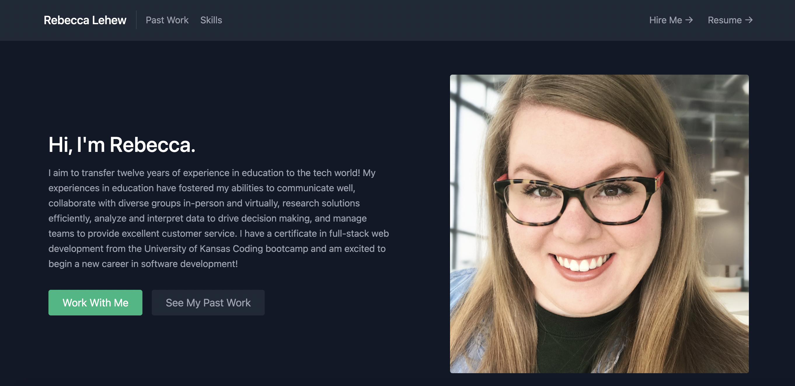
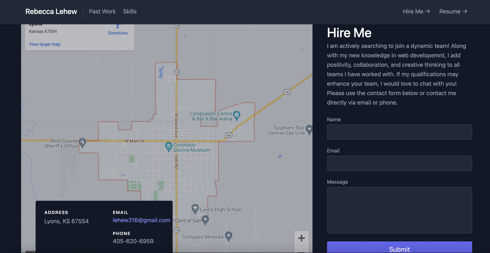
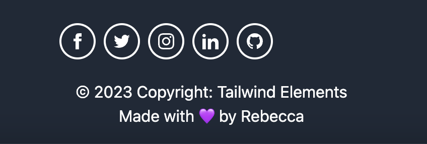

# React Portfolio

## Table of Contents:
- [Description](#description)
- [Challenges](#challenges)
- [Contributions](#contributions)
- [License](#license)

## Description
A single page portfolio of my personal and team projects using React.

## Challenges
- Thinking in terms of JSX syntax instead of HTML. My app wouldn't render correctly until I tracked down 'class' and changed to 'className' and using '{}' instead of 'style' references in each HTML tag. Once I got the syntax issues sorted, my React app rendered!
- Fonts. I am happy with my current app. With the time I currently have available, it is a great launching point for future development. I would like to change the color scheme, fonts, and make the overall vibe more warm and cozy.
- Server-side. This current app does not require server-side development. However, I would like to add that feature to my portfolio site. I would love to see the contact form actually work on my page.
- I can't get the social icons to center properly! I've learned Tailwind is not my favorite...

## Contributions
This app was created in conjuction with the coding bootcamp program at the University of Kansas. Please contact me, Rebecca, directly for guidelines.
- [Rebecca Lehew](https://github.com/rebeccalehew)

## License:
Licensed under the [MIT](https://opensource.org/licenses/MIT) license.

